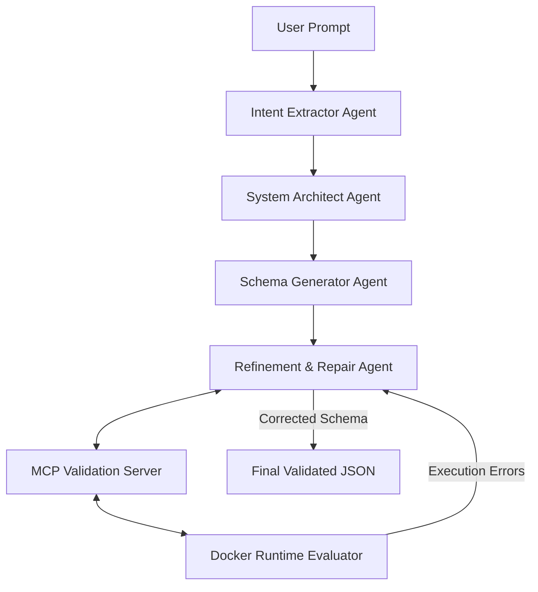

# Implementation Plan: AI Engineer Compiler Pipeline

This document outlines the proposed design and architecture for the compiler-like software generation system. Feel free to edit this file to adjust the design, components, or tasks.

## 🛠 Tech Stack
- **Orchestration**: CrewAI (Python-based multi-agent framework)
- **Validation**: Pydantic v2 (for strict schema enforcement)
- **Extensibility & Tooling**: Model Context Protocol (MCP) servers (Python standard implementation)
- **Runtime Evaluation**: Docker (using the official Python `docker` SDK to run and test schemas in isolated containers)
- **Testing**: `pytest`

---

## 🏗 System Architecture



---

## 🗂 Directory Structure

```text
prompt2go/
├── docker/
│   ├── Dockerfile             # Sandbox environment for runtime validation
│   └── test_runner.py         # Script that loads/executes schemas inside the container
├── src/
│   ├── agents/
│   │   ├── __init__.py
│   │   ├── crew.py            # CrewAI definitions (agents, tasks, setup)
│   │   └── tools.py           # CrewAI custom tools wrapping MCP capabilities
│   ├── mcp_server/
│   │   ├── __init__.py
│   │   └── server.py          # Python MCP server with verification tools
│   ├── runtime/
│   │   ├── __init__.py
│   │   └── evaluator.py       # Manages Docker container lifecycles & execution testing
│   ├── schemas/
│   │   ├── __init__.py
│   │   └── models.py          # Pydantic schemas (UI, API, DB, Auth)
│   ├── evaluation/
│   │   ├── __init__.py
│   │   ├── dataset.json       # 10 product prompts + 10 edge case prompts
│   │   └── run_eval.py        # Runs metrics collection (latency, cost, success rate)
│   ├── __init__.py
│   └── main.py                # Main compiler entry point
├── tests/
│   └── ...
├── pyproject.toml             # Poetry/Pip project configuration
└── implementation_plan.md     # This file
```

---

## 🧩 Component Breakdown

### 1. Multi-Stage Pipeline (CrewAI Agents)
- **Intent Extractor Agent**: Extracts requirements from natural language. Filters out vagueness or flags it for assumptions/clarifications.
- **System Architect Agent**: Maps the requirements to system architecture (data models, API routes, user roles, UI views).
- **Schema Generator Agent**: Converts architecture into JSON/YAML matching the strict schema.
- **Refinement & Repair Agent**: Runs verification tools. If failures occur, pinpoint the exact layer and re-generate or repair the specific schema block.

### 2. Validation Schema (Pydantic Models)
We will define strict validation models for:
- **UI Config**: Layout templates, component tree, binding fields to API.
- **API Config**: Routes, HTTP methods, request payloads, response bodies, auth requirements.
- **Database Schema**: Entity definitions, primary/foreign keys, field types (matching API payloads).
- **Auth Rules**: Role-based access control (RBAC) mapping users to components and endpoints.

### 3. MCP Validation Server (Standard Protocol)
A local Python MCP server communicating via `stdio`. It exposes tools:
- `validate_json_syntax(json_str)`: Basic JSON validation.
- `validate_schema_consistency(schema)`: Validates cross-layer constraints (e.g. database fields map correctly to API parameters).
- `trigger_docker_validation(schema)`: Sends the schema to the runtime evaluator.

### 4. Docker Runtime Evaluator
- Spins up a docker container using a pre-configured node or python image.
- Dynamically compiles or executes the generated schema (e.g., builds database tables, starts a mock server, runs standard HTTP requests against endpoints).
- Captures and formats stdout/stderr/test failures, sending them back to the MCP server.

### 5. Evaluation Framework
- A pipeline evaluator that loops through the `dataset.json` file.
- Tracks:
  - Success rate (valid schema + successful runtime execution).
  - Retry attempts / repair cycles.
  - LLM latency and estimated cost (input/output tokens).
  - Failures classified by type (JSON syntax, schema inconsistency, runtime crash).

---

## 🚀 Step-by-Step Execution Plan

### Step 1: Project Setup & Dependencies
- Create `pyproject.toml` with dependencies (`crewai`, `mcp`, `docker`, `pydantic`).
- Set up python environment.

### Step 2: Define Pydantic Schemas
- Draft schema definitions for UI, API, DB, and Auth in `src/schemas/models.py`.

### Step 3: Implement Docker Runtime Evaluator
- Write the `Dockerfile` and a test runner that executes a schema to verify it works (e.g. spins up FastAPI mock routes and performs query tests).
- Build python runtime evaluator script using Docker SDK.

### Step 4: Implement Python MCP Server
- Write MCP server using `mcp` Python SDK, exposing Pydantic validation tools and Docker runtime tool.

### Step 5: Implement CrewAI Pipeline
- Configure agents, custom tools (wrapping MCP clients), and tasks.
- Build the feedback loop for automated repair.

### Step 6: Create Evaluation Dataset & Test Runner
- Write `dataset.json` containing 20 test prompts.
- Implement evaluation runner to compile all prompts, log stats, and print metrics.
